# History University Website
History of Universitys, a comprehensive website dedicated to exploring the rich and diverse history of universities in the west particularly. This site aims to provide an in-depth look at the evolution of higher education institutions, highlighting their significant milestones and the impact they have had on society. Our target audience is directed towards current higher education students or people who have already been to university, but in general adults since this can be a fact heavy article with alot of references.
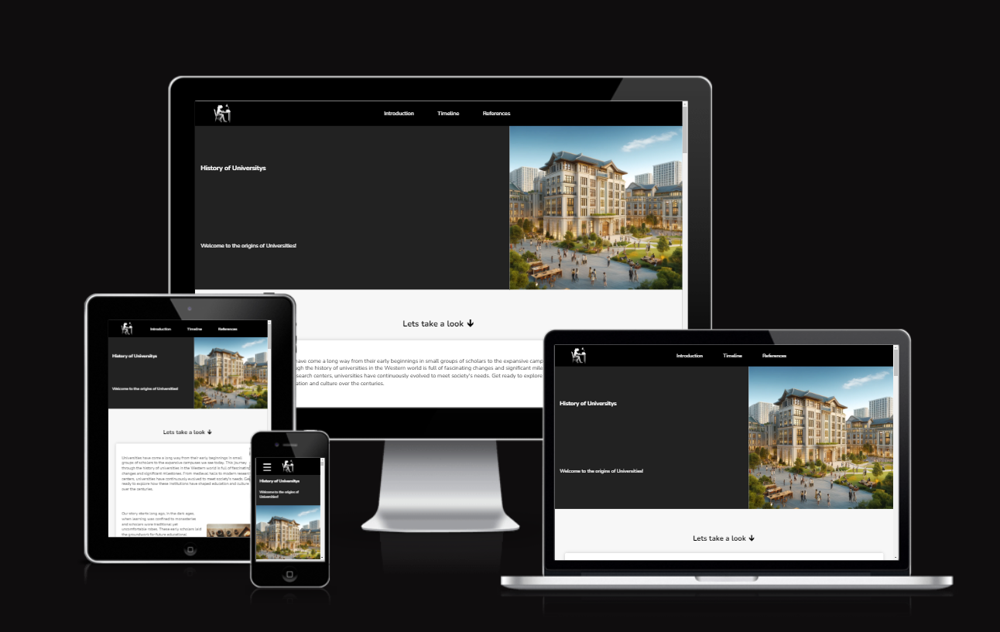

[Live Website Link](https://haashimh1.github.io/Deploma/)

## Table of contents

* [User Expectations](#user-expectations)
* [Features](#interface-structure--features-justification)
  * [General](#overall-features)
  * [Nav Bar](#navigation-bar)
  * [Page 1](#page-1---intro-page)
  * [Page 2](#page-2---timeline-page)
  * [Page 3](#page-3---reference-page)
  * [Footer](#footer)
* [Testing](#testing)
* [Validation of code](#validating-code)
* [Deployment](#deployment)
* [Credits](#credits)

## User Expectations

Any user who come to this site should want to expect the following

* Easy to use Nav bar that is very accessible
* A brief not extensive look into the history
* References for facts shown
* A good structured website that is easy to follow
* Useful colour scheme for good contast between sections of the page.
* Semantic structure used for people with asisted technologies.

## Interface Structure / Features Justification

This site consits of 5 main sections: Navigation bar, 3 pages and a footer. The pages are aas floating pages so its one big scrollable website instead of 3 different wesbite files. Note that when this documentation refers to 'smaller' or 'bigger' screens, smaller screens is refering to mostly mobile phones or in particular screen widths of less than 768 pixels, bigger screens is of tablets or desktops of 768 pixels or more in its width.

### Overall features
  * Technologies used
    * HTML5, CSS, JavaScript languages
    * Git, GitHub, GitPod and Chrome Develepor tools
  * Colour Scheme - I chose to go with a simple black, grey and white scheme for this site as it suits an article feel as theres no necesity for popping colours as this site is directed more towards adults, and is also one of the best contrasting schemes for people who may have visual impairments.
  * Font - A google font know as 'Nunito' as this is a sleek yet eye catching font that is perfect for the aesthetic for a history website.

### Navigation Bar
  * A bar at the top of the screen that holds links to different section of the website for easy and quick navigation with a black background as it easily seperates itself from the main conent of the page to a user as this bar has a much different purpose to the main content of the page. On all screen sizes it house a clickable logo, which redirects user to the very top of the website. All links on the Nav bar have a smooth scroll effect to its destination using JavaScript.

    * Smaller screens - houses a button which opens a dropdown menu which holds links to all 3 pages on this website. When dropdown opens, the toggle buttons text changes to a downward arrow signsignifying that it is open. 
    
    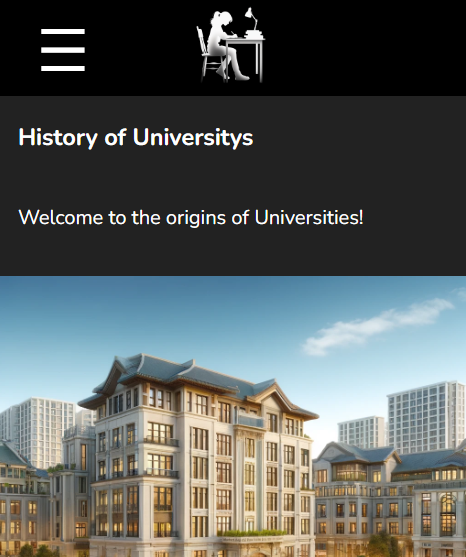
    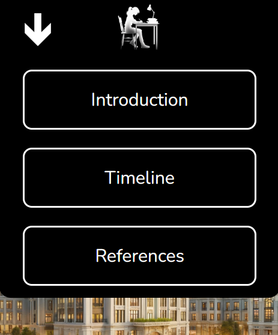

    * Bigger screens - All 3 page links are already present in the original Nav bar with no dropdown menu present as there is more pace to work with. This time with a hover transition which emphasizes the link hovered over.
    * 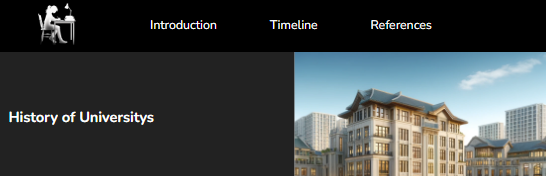
    * 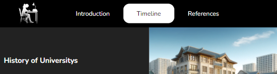

### Page 1 - Intro Page
  * This page is split into 2 segments. 1st Segment consists of an intro message and a picture to set the scene of the website, helps user visualize the content provided.
  
    * Smaller screen it is stacked ontop of eachother
      * 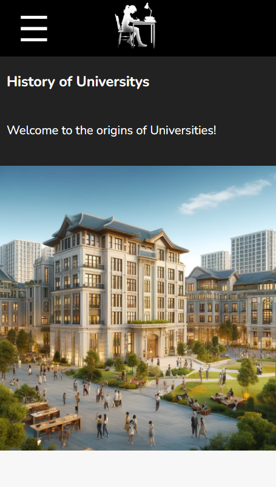
    * Bigger screeen stacked sideways
      * 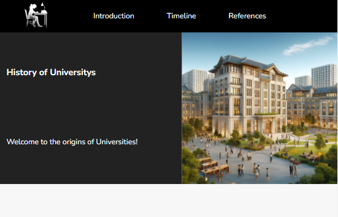

  * 2nd Segment consists of two intro paragraphs with another image. This is to give a brief summary of the website before the user gets into the fact heavy content to help ease in. This is where we get into the main Page segments of each page as its shown by the white box content with a shadow around it, this will be same theme with the other 2 page segments aswell.
     * Bigger screens / Smaller Screens
  * 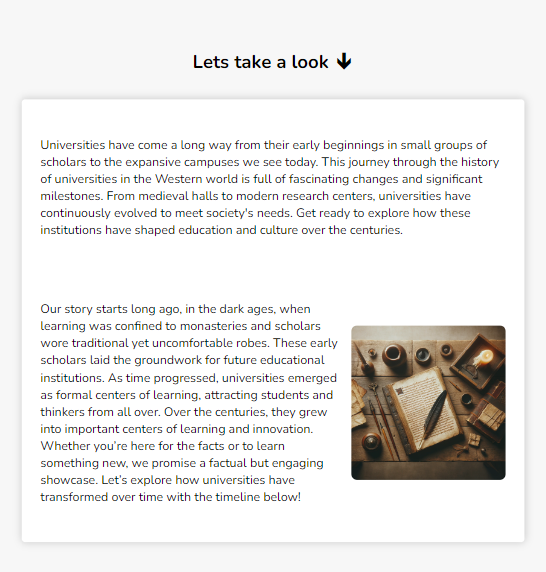 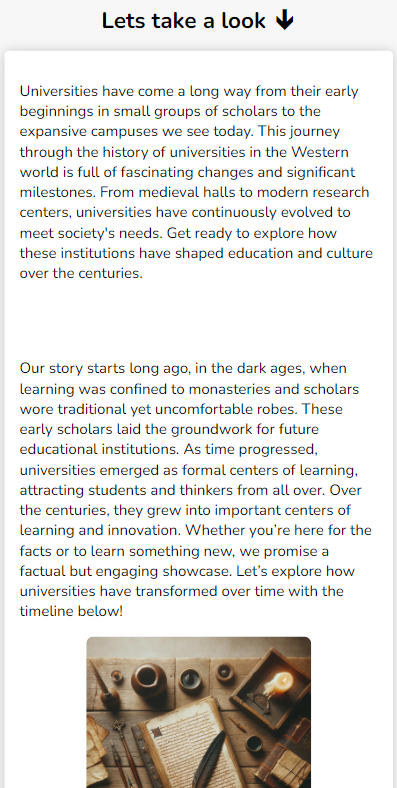

### Page 2 - Timeline Page
  * The purpose of this page is to provide a linear timeline showcasing its history, consists of 5 different time periods each with a date range, heading, image and a handfull of bullet points of content for that time period. The image in each time period is crucial since it gives the user a visual representation of what the environment would look like in a university in each period. Again the whole timeline is wrapped around a white box with a shadow on its sides. Below are a few examples of how it would look.

    * Bigger screens, half of the time periods images and content are flipped to add some diversity in the page and not seem all the same.
      * 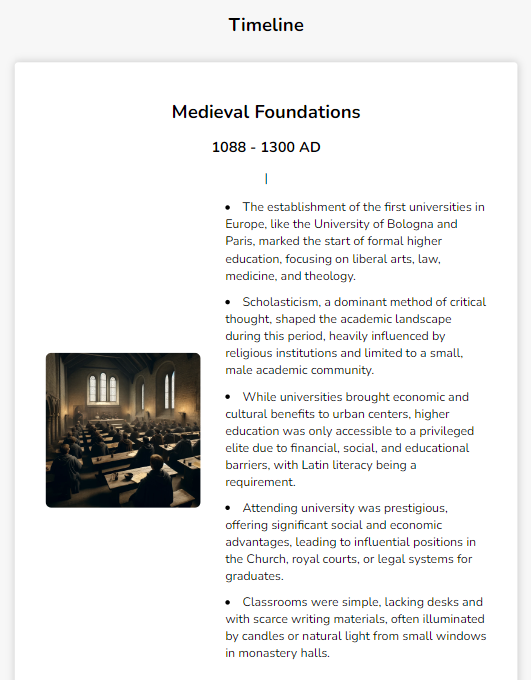
      * 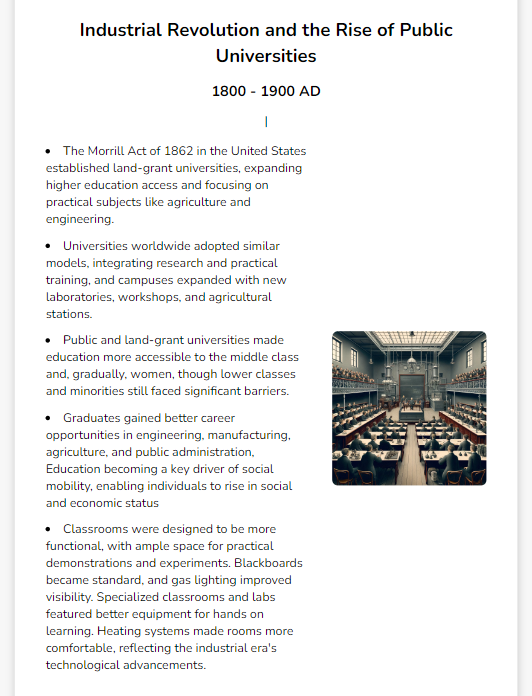
    * Smaller screens, content just stacked veritcally as theres not much room for diversity
      * 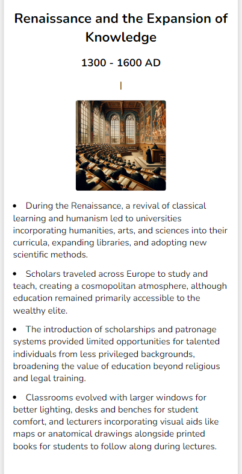 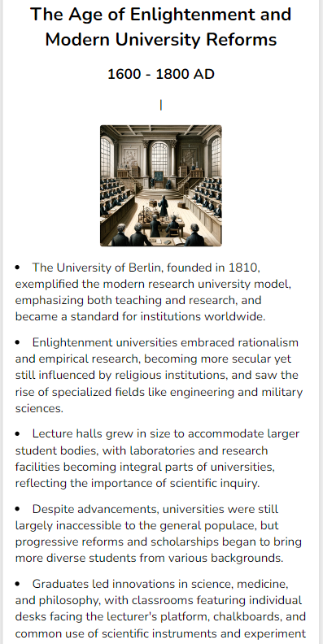

### Page 3 - Reference Page
  * This page is to provide as many references to historic yet authentic books i can find to back up all the facts i had displayed in the timeline. This helps to further engage the user as it mostly likely an adult who come to this page, and they tend to be skeptical about websites they are unfamiluar with so this helps to clear the doubt and ensure the user. This is the final time i use the white box with a shadow on its sides as this is the last page.
  
    * Page is split into 5 sections, each representing a time period from the timeline. Each section containing the time periods naem, which facts I used and its reference.
    * Bigger Screens, with more space provided content is seperated more to add extra visual clarification to each heading and its content.
      * 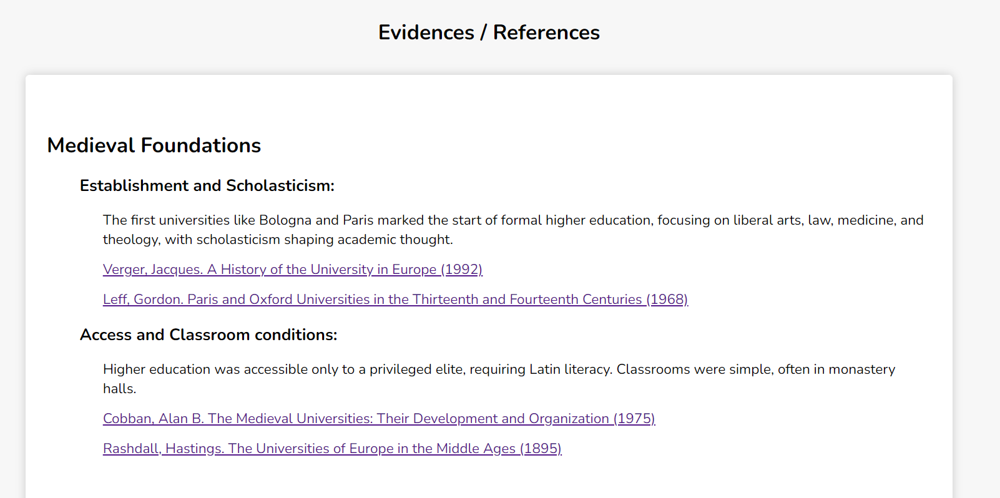
    * Smaller screens, less space to work with so no extra space between heading and its content
      * 
### Footer
  * Only purpose of the footer is to provide a link to my github, in the form of clickable github logo, and some text naming the author of this website. Footer copys the design and colour scheme of the Nav bar to again emphasize to the user the much different purpose and content of these bars.
  * Bigger and smaller screens only differences are the position of the content container, as theres not any necesity to design the content differently because of the small amount of content placed here.
    * Smaller Screens
      * 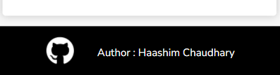
    * Bigger Screens
      * 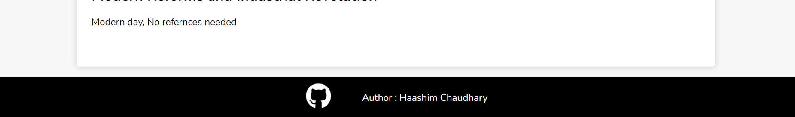

## Testing

| Action                              | Expected Result              | Pass/Fail |
|-------------------------------------|------------------------------|-----------|
| Dropdown button, when closed        | Shows dropdown menu          | Pass      |
| Dropdown button, when open          | Hide dropdown menu           | Pass      |
| Dropdown button content             | Button text changes          | Pass      |
| Dropdown Page clicked               | Hide dropdown and then scroll| Pass      |
| Page links / logo clicked           | Smooth scroll to destination | Pass      |
| GitHub logo click                   | Open Github repo new tab     | Pass      |
| All links clicked                   | Open in new tab              | Pass      |
| Image file path broken              | Alt text                     | Pass      |
| Different Web Browsers              | Same on all browsers         | Pass      |

## Validating Code

* HTML
  * No errors were returned when passing through the official [W3C Validator](https://validator.w3.org/)
* CSS
  * No errors were returned when passing through the official [Jigsaw Validator](https://validator.w3.org/)
* Lighthouse
  * Scored high on both Mobile and Desktop.
    * 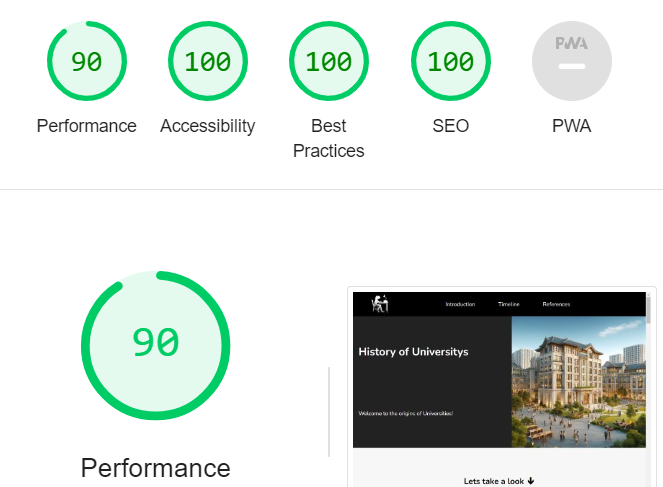
    * 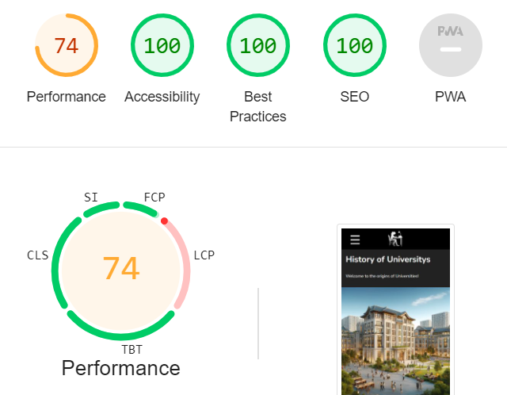
* Wave
  * No error through validator, however 1 alert for a link to a PDF file, which is valid in this case since the reference page holds a link to a book which the reference came from to improve authenticity of the facts in my website.
    * 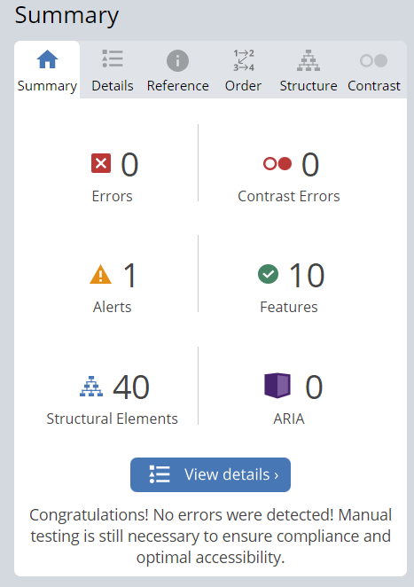 
    * 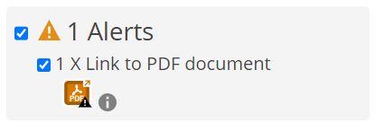

## Deployment

This History website was deployed to GitHub pages. The steps to deploy are as follows:

1. In the GitHub repository, navigate to the Settings Tab.
2. From the source section drop-down menu, select the Master Branch.
3. Once this is selected, the page will be automatically refreshed with a detailed ribbon display to indicate successful deployment. The live link can be found on GitHub [here](https://haashimh1.github.io/Deploma/)

** Note that all my commits with a 'f-' at the begining signifies a Feature added in that commit

### Clone from GitHub
To clone this repository, follow these steps:

1. On the repository's GitHub page, click on the "Code" button.
2. In the dropdown, click on "Clone" to copy the repository's URL to your clipboard.
3. Open your terminal.
4. Go to the directory where you want to clone the repository.
5. Use the git clone command followed by the URL you copied, hit ENTER.
* Done, cloned to your local machine!

## Credits

* All images (but GitHub logo) used were generated from text descriptions with [DALL-E by OpenAI](https://openai.com/index/dall-e-3/).
* GitHub logo is a free image from [Pixabay](https://pixabay.com/vectors/github-github-logo-github-icon-6980894/) 
* Font utilized in this website is from [Google Fonts](https://fonts.google.com/).
* All facts and referneces compiled and used from [Wikipedia](https://en.wikipedia.org/wiki/University).
* White box page segments against a Lightgrey background design inspired by an article [Here](https://palestinecampaign.org/resources/history/).
* Introduction segment inspired by an article [Here](https://www.history.com/topics/european-history/london-england)
* Feedback from my mentor Akshat Garg @ [Code Institute](https://codeinstitute.net/)

