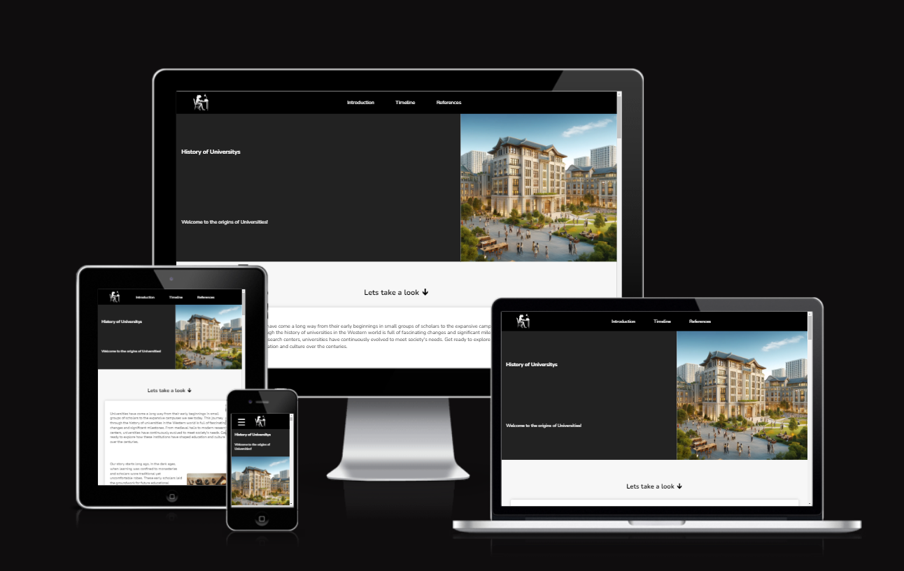
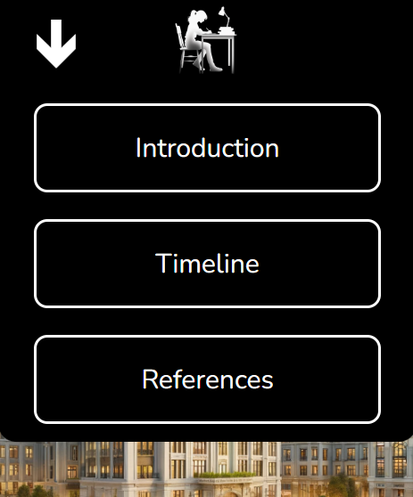
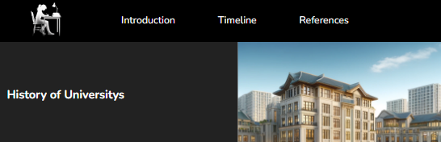
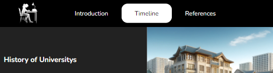

# History University Website
History of Universitys, a comprehensive website dedicated to exploring the rich and diverse history of universities in the west particularly. This site aims to provide an in-depth look at the evolution of higher education institutions, highlighting their significant milestones and the impact they have had on society. Our target audience is directed towards current higher education students or people who have already been to university, but in general adults since this can be a fact heavy article with alot of references.

## Interface Structure / Features

This site consits of 5 main sections: Navigation bar, 3 pages and a footer. The pages are aas floating pages so its one big scrollable website instead of 3 different wesbite files. Note that when this documentation refers to 'smaller' or 'bigger' screens, smaller screens is refering to mostly mobile phones or in particular, screen widths of less than 768 pixels, bigger screens is of tablets or desktops of 768 pixels or more in its width.

* Overall features
  * Colour Scheme - I chose to go with a simple black, grey and white scheme for this site as it suits an article feel as theres no necesity for popping colours as this site is directed more towards adults, and is also one of the best contrasting schemes for people who may have visual impairments.
  * Font - A google font know as 'Nunito' as this is a sleek yet eye catching font that is perfect for the aesthetic for a history website.

* Navigation Bar
  * A bar at the top of the screen that holds links to different section of the website for easy and quick navigation with a black background as it easily seperates itself from the main conent of the page to a user. On all screen sizes it house a clickable logo, which redirects user to the very top of the website. All links on the Nav bar have a smooth scroll effect to its destination using JavaScript.

  * Smaller screens - houses a dropdown button which opens a dropdown menu which holds links to all 3 pages on this website. When dropdown opens, the toggle buttons text changes to a downward arrow signsignifying that it is open. 
    
    
    

  * Bigger screens - All 3 page links are already present in the original Nav bar with no dropdown menu present as there is more pace to work with. This time with a hover transition which emphasizes the link hovered over.
    * 
    * 

* Page 1 - Intro Page
  * dknsbdius    

